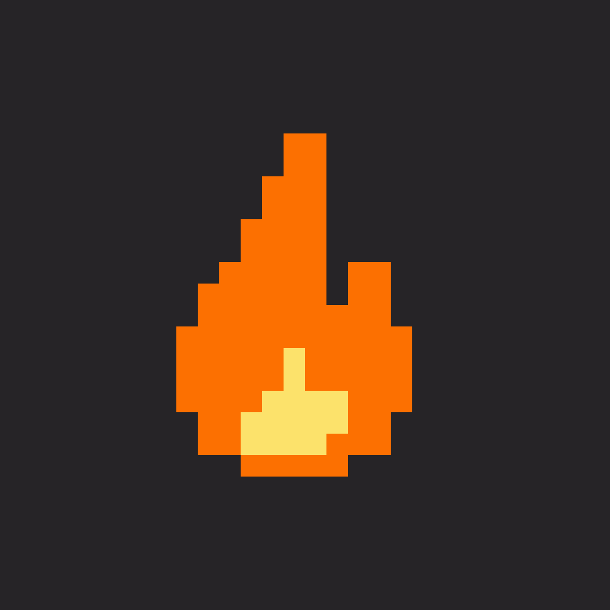

# TinyFire

> If you're burning tokens anyway, light a real fire.  
> 既然都在烧 token，不如真的生一把火。

TinyFire is a macOS menu-bar companion that turns local AI coding-tool token usage into a live desktop campfire. Codex, Claude Code, Cursor, Grok, Pi, Amp — as you burn tokens, the fire grows; when you stop, it settles into embers.

Nothing is uploaded for usage tracking. Logs stay on your Mac.



## Download

[**TinyFire-1.1.6.dmg**](https://github.com/wdkwdkwdk/tinyfire/releases/download/v1.1.6/TinyFire-1.1.6.dmg) — macOS 14+, Apple Silicon · Developer ID + notarized
## Features

- Floating pixel campfire on the desktop (draggable, hideable, non-activating)
- Hover card for today's tokens + per-source breakdown
- Console: stats charts, flame colors, source status, size, language
- Languages: English / 中文 / 日本語 / 한국어 (+ system)
- Cursor usage prefers the official Dashboard API when a local token is available, otherwise falls back to local estimate
- Optional update check on launch (endpoint configured privately by the maintainer)
- Console debug panel (tap version 10×) and clickable flame-size previews

## Install from source

```bash
# Xcode 16+, macOS 14+
open tinyFire.xcodeproj
# Product → Run
```

Package a DMG:

```bash
./scripts/make-dmg.sh
# → dist/TinyFire-<version>.dmg
```

## Privacy

TinyFire reads **local** usage logs only (and optionally Cursor's local access token for the Dashboard API). Usage data is not uploaded.

## License

MIT
